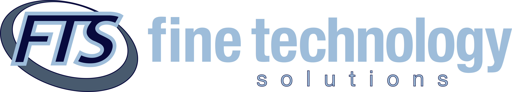

# 
## Founded in 1997 by Michael Fine, Fine Technology Solutions is everything an effective technology partner should be!
## From first idea to finished product, we're with you every step of the way.

* Software Solutions & Development
* AI & Agentic Workflows
* Project Management
* FullStack Web Development
* Mobile Development
* UI/UX Design
* Cloud Architecture
* CyberSecurity
* IT Infrastructure & Management
* On-Site & Remote Support

### We have years of hands-on experience working with a wide range of clients--from home-based businesses to large enterprises.
### As your preferred software developer, we work within your budget to get high quality professional results.
### As your project partner, we plan, manage, and deliver technology projects with clear communication from kickoff to launch.
### We help businesses adopt AI with confidence, building AI-assisted development and agentic workflows that automate routine work and speed up delivery.
### Our commitment ensures a stable, secure computing environment, fast response times, and access to IT experts using a suite of world-class support tools.
### As your technology partner, we are always ready to help with any size technology problem or device.

###	 
## Smarter Technology, Built for Your Business
~~~~
 +1 (800) 910-FINE

 (760) 274-2370

 San Diego, CA 
~~~~
